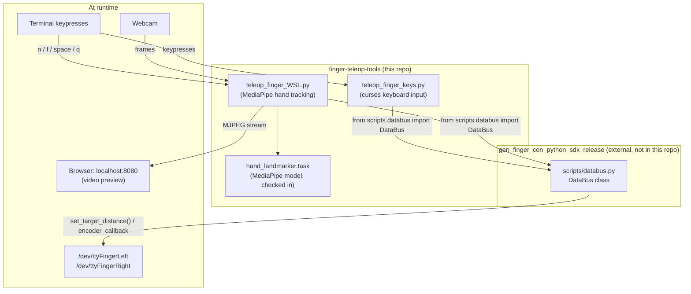

# GenRobot Finger Teleoperation Tools

A collection of Python tools for teleoperating a GenRobot Finger Controller through the **GenRobot Finger Controller Python SDK**.

This repository includes:

- Keyboard-based finger control (`teleop_finger_keys.py`) — single or dual finger controller, works identically on WSL2 and native Linux (curses reads keys straight from the terminal, no display server required)
- Browser-previewed hand-tracking finger control (`teleop_finger_WSL.py`) — single or dual finger controller, streams annotated video to a local browser and reads hotkeys from the terminal, built for environments (like WSL2) where a native OpenCV preview window isn't reliably available

> This repository does not include the GenRobot Finger Controller Python SDK. Clone and configure the SDK separately — see [Setup](#setup) below.

## Project structure

```
finger-teleop-tools/
├── README.md
├── .gitignore
├── requirements.txt
├── hand_landmarker.task          # MediaPipe hand landmark model (binary, checked in — see note below)
├── teleop_finger_keys.py         # Keyboard control — WSL2 + native Linux
├── teleop_finger_WSL.py          # Hand-tracking control — browser-previewed, WSL2-oriented
└── scripts/                      # NOT part of this repo — symlink or copy in from the SDK (see Setup)
    ├── __init__.py
    ├── databus.py
    ├── das_protocol.py
    ├── pack.py
    ├── system.py
    ├── camera.py
    └── camera_cmd.py
```

`scripts/` is deliberately excluded from this repo (see `.gitignore` philosophy below) — it belongs to `gen_finger_con_python_sdk_release` and should be symlinked in, not duplicated, so it always reflects the SDK version you actually have installed.

### How the pieces fit together



## Prerequisites

- Python 3.8+
- GenRobot Finger controller (one for single mode, two for dual mode)
- The **GenRobot Finger Controller Python SDK** (`gen_finger_con_python_sdk_release`), with its `scripts/` folder accessible from wherever you run these tools
- `teleop_finger_WSL.py` additionally needs a webcam and (on WSL2) a Chrome/Edge browser on the Windows host to view the stream
- A safe, clear workspace for testing finger motion

## Setup

1. Clone the SDK separately (not part of this repo):

```bash
git clone https://github.com/genrobot-ai/gen_finger_con_python_sdk_release.git
```

2. Clone this repo:

```bash
git clone https://github.com/anthonyshen-GR/gen_finger_con_teleop_python.git
cd gen_finger_con_teleop_python 
```

3. Make `scripts/` from the SDK accessible next to these scripts — symlink is recommended so this repo never drifts from your actual SDK version:

```bash
ln -s /path/to/gen_finger_con_python_sdk_release/scripts ./scripts
```

4. Create and activate a virtual environment, then install dependencies:

```bash
python3 -m venv venv
source venv/bin/activate
pip install -r requirements.txt
```

If you hit a `PEP 668 externally-managed-environment` error installing without a venv, either use the venv above (recommended) or add `--break-system-packages` to the `pip install` command.

5. Ensure your udev rules are set up so the controller(s) appear as `/dev/ttyFingerLeft` / `/dev/ttyFingerRight` (see the SDK's `docs/usb-setup.md`). On WSL2, this also requires `usbipd attach`-ing the device(s) — device and any USB passthrough steps must be redone after every WSL restart or replug.

## `teleop_finger_keys.py` — Keyboard Control

Opens a curses-based terminal UI showing target distance, encoder reading, and a live position bar. No camera required.

### Modes

Single finger:
```bash
python3 teleop_finger_keys.py left
python3 teleop_finger_keys.py right --port /dev/ttyUSB0
```

Dual finger — WASD drives the left finger, arrow keys drive the right finger, at the same time:
```bash
python3 teleop_finger_keys.py dual
python3 teleop_finger_keys.py dual --left-port /dev/ttyUSB0 --right-port /dev/ttyUSB1
```

### Controls

| Key | Single mode | Dual mode |
|-----|--------------|-----------|
| Right / Up | Open | Open RIGHT finger |
| Left / Down | Close | Close RIGHT finger |
| D / W | — | Open LEFT finger |
| A / S | — | Close LEFT finger |
| Space | Stop/hold | Stop/hold both |
| Home | Full open (0.200 m) | Both full open |
| End | Full close (0.000 m) | Both full close |
| R | Re-center to 0.050 m | Both re-center |
| Q | Disable motor and quit | Disable both and quit |

### Options

| Flag | Default | Description |
|------|---------|--------------|
| `--port` | `/dev/ttyFingerLeft`/`Right` | Serial port override, single mode only |
| `--left-port` | `/dev/ttyFingerLeft` | Left finger's serial port, dual mode only |
| `--right-port` | `/dev/ttyFingerRight` | Right finger's serial port, dual mode only |
| `--step-rate` | `0.08` | Meters/second of travel while a direction key is held |
| `--start` | `0.05` | Starting target distance, meters |
| `--hz` | `30.0` | Control loop rate |

## `teleop_finger_WSL.py` — Hand-Tracking Control (browser preview)

Streams your webcam feed with a MediaPipe hand skeleton overlay to `http://localhost:8080`, viewable in Chrome/Edge on the Windows host. Hotkeys are read from the terminal (not the browser window), since WSL2 typically has no reliable way to capture keypresses from a browser tab back into the controlling process.

### Modes

Single finger:
```bash
python3 teleop_finger_WSL.py left
python3 teleop_finger_WSL.py right
```

Dual finger — left hand drives the left finger, right hand drives the right finger, both from one webcam feed:
```bash
python3 teleop_finger_WSL.py dual
python3 teleop_finger_WSL.py dual --left-port /dev/ttyUSB0 --right-port /dev/ttyUSB1
```

### Calibration

Before a hand can drive a finger, its pinch (thumb tip to index fingertip) needs a closed and an open reference point:

- `n` — capture the current pinch as the CLOSED reference
- `f` — capture the current pinch as the OPEN reference

In dual mode, `n`/`f` apply to whichever hand(s) have been seen so far — pinch with one hand and press `n`, then the other hand and press `n` again, or do both hands at once. Typed in the terminal, not the browser.

### Controls (terminal)

| Key | Action |
|-----|--------|
| `n` | Capture current pinch as CLOSED reference |
| `f` | Capture current pinch as OPEN reference |
| `SPACE` | Freeze/unfreeze target(s) |
| `q` / `ESC` | Disable motor(s) and quit |

### Options

| Flag | Default | Description |
|------|---------|--------------|
| `--port` | `/dev/ttyFingerLeft`/`Right` | Serial port override, single mode only |
| `--left-port` | `/dev/ttyFingerLeft` | Left finger's serial port, dual mode only |
| `--right-port` | `/dev/ttyFingerRight` | Right finger's serial port, dual mode only |
| `--webcam-index` | `0` | OpenCV camera index |
| `--smoothing` | `0.4` | Pinch-ratio smoothing factor |
| `--hz` | `30.0` | Control loop rate |
| `--http-port` | `8080` | Local port the video stream is served on |
| `--invert-hands` | off | Dual mode only — swap which detected hand drives which finger |

## Dependencies

```
pyserial>=3.5
opencv-python>=4.5.0
mediapipe>=0.10.0
numpy>=1.19.0
```

Install with `pip install -r requirements.txt`.

`hand_landmarker.task` (MediaPipe's hand landmark model, used by `teleop_finger_WSL.py`) is checked into this repo rather than downloaded at runtime — it's a binary file (~7-8MB), so if you'd rather not commit binaries to git history, remove it from the repo and add a small download step to `teleop_finger_WSL.py` instead (the model is publicly hosted by Google; the gripper repo's equivalent script has this pattern if you want a reference).

## Distance range and port naming — why these differ from the gripper tools

If you're coming from `teleop-tools` (gripper controller), two constants are different here, confirmed against the actual `gen_finger_con_python_sdk_release` source rather than assumed:

- **Valid distance range is `[0.0, 0.2]` meters** (~20cm), not the gripper's `0.0–0.103`
- **Serial ports are `/dev/ttyFingerLeft` / `/dev/ttyFingerRight`**, not `/dev/ttyDevice*`
- The finger SDK's `DataBus` takes **no `gripper_type` parameter** — there's no equivalent concept for the finger controller

## Safety

- Standalone scripts — do not run alongside `start_finger.py` or any other process holding the same serial port. Two processes on one port will corrupt the protocol stream (symptoms: `ValueError: 0 is not a valid RecordType`, `multiple access on port`).
- This applies per-port in dual mode: make sure nothing else is touching either the left or right serial port before starting.
- Keep the finger workspace clear before connecting — target distance defaults to 0.05m on startup and moves immediately once a control loop begins.